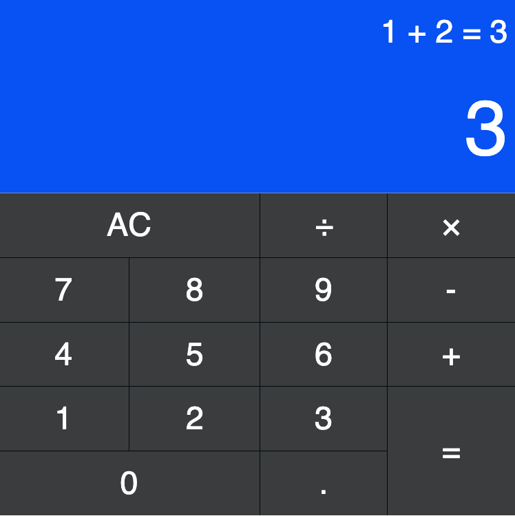

# JavaScript Calculator 
Developed: FreeCodeCamp front-end-libraries Project #4

See Project Details: https://learn.freecodecamp.org/front-end-libraries/front-end-libraries-projects/build-a-javascript-calculator


## Run the project

```sh
$ npm run start
```

## Deployed in Live

Go to: http://bit.ly/js-calculator-fcc

<br/>

